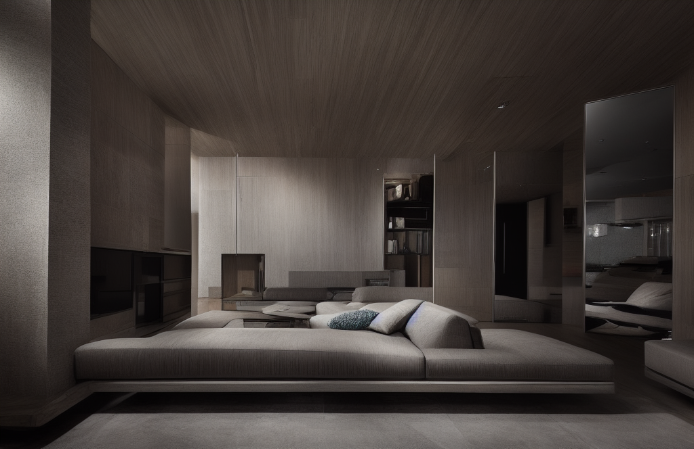

<div align="center">
<h1> Interior-stable-difusion: Revolutionizing Interior Design with Rapid Visualization and Customization
</div>

<div style="display: flex; justify-content: center; flex-wrap: nowrap; overflow-x: auto;">
  
  
  
</div>

The evolution of AI technologies like Stable Diffusion(<https://arxiv.org/abs/2112.10752>) has revolutionized visual design. Now, with "Interior-Stable-Diffusion," this technology is tailored for interior design, enabling rapid generation, style modification, and object replacement in interior spaces. This application empowers designers to visualize and refine spaces with unprecedented speed and precision, transforming ideas into reality in moments.

## Main Functions

Using Stable Diffusion, this app can make desirable images with three main function:

- General generation: Utilize the [text2img pipeline](https://huggingface.co/docs/diffusers/en/api/pipelines/stable_diffusion/text2img) to create detailed interior images from textual descriptions.
- Fixing style: Utilize the [Controlnet Canny](https://huggingface.co/lllyasviel/sd-controlnet-canny) echnique to maintain the original image’s edges while introducing a new style based on the canny edge map.
- Replacing object: using [ControlnetInpaintPipeline](https://huggingface.co/docs/diffusers/en/api/pipelines/controlnet#diffusers.StableDiffusionControlNetInpaintPipeline) to seamlessly replace objects within specified masked areas of an image.

## Examples

### General generation

<div style="display: flex; justify-content: center; flex-wrap: nowrap; overflow-x: auto;">
  
  
</div>
<p align="center">Prompt: A living room with a TV, wooden floor, a sofa, a nice glass table and a flower in the table</p>
<div style="display: flex; justify-content: center; flex-wrap: nowrap; overflow-x: auto;">
  
  
</div>
<p align="center">Prompt: A large modern kitchen with light grey, brown and white, large kitchen cabinets</p>

### Fixing style

<div style="display: flex; justify-content: center; flex-wrap: nowrap; overflow-x: auto;">
  
  
</div>
<p align="center">Change: A black table</p>
<div style="display: flex; justify-content: center; flex-wrap: nowrap; overflow-x: auto;">
  
  
</div>
<p align="center">Change: A colorful violet chandelier, darker ceiling.</p>

### Replacing object

<div style="display: flex; justify-content: center; flex-wrap: nowrap; overflow-x: auto;">
  
  
  
</div>
<p align="center">Prompt: a fridge</p>
<div style="display: flex; justify-content: center; flex-wrap: nowrap; overflow-x: auto;">
  
  
  
</div>
<p align="center">Prompt: a luxury liquor cabinet</p>

## Installation and Usage

### Environment setup

```
python3 -m venv .env
source .env/bin/activate

git clone https://github.com/Trgtuan10/Interior-stable-difusion.git
cd Interior-stable-difusion
pip install -r requirements.txt
```

### Download my checkpoint

```
mkdir checkpoints
cd checkpoints
wget https://civitai.com/api/download/models/128713 -O Interior.safetensors
wget https://civitai.com/api/download/models/195419 -O Interior_lora.safetensors
```

### Run app

```
cd App_demo
streamlit run streamlit_app
```

## What We Did (Modifications)

### Demo: Before & After

<div style="display: flex; justify-content: center; flex-wrap: nowrap; overflow-x: auto;">
  
  
</div>
<p align="center"><i>Left: Original Room | Right: AI-Generated Interior Design</i></p>

### Multi-Platform Device Support

We added automatic device detection to support multiple hardware configurations:

- **Apple Silicon (MPS)**: Optimized for M1/M2/M3/M4 Macs using Metal Performance Shaders
- **NVIDIA GPU (CUDA)**: Full support for NVIDIA GPUs with float16 precision
- **CPU Fallback**: Works on any machine without GPU acceleration

### Memory Optimizations

- Enabled `attention_slicing("max")` for MPS devices to reduce memory usage
- Dynamic dtype selection (float32 for MPS/CPU, float16 for CUDA)
- Optimized tensor operations for cross-platform compatibility

### Files Modified

| File | Changes |
|------|---------|
| `base_gen.py` | Added MPS/CUDA/CPU device detection and memory optimizations |
| `image_condition_gen.py` | Multi-platform support with dtype handling for ControlNet pipeline |
| `inpainting_gen.py` | Cross-platform inpainting with optimized tensor operations |
| `.gitignore` | Updated to exclude common dev files and checkpoints |
| `requirements.txt` | Cleaned up dependencies |

### Device Detection Code

```python
# Device detection: MPS for Mac, CUDA for NVIDIA, CPU fallback
if torch.backends.mps.is_available():
    DEVICE = "mps"
    DTYPE = torch.float32  # MPS works better with float32
elif torch.cuda.is_available():
    DEVICE = "cuda"
    DTYPE = torch.float16
else:
    DEVICE = "cpu"
    DTYPE = torch.float32
```

## Contributors

- Original Author: [@Trgtuan10](https://github.com/Trgtuan10)
- Modifications: [@hariom-hp](https://github.com/hariom-hp)
